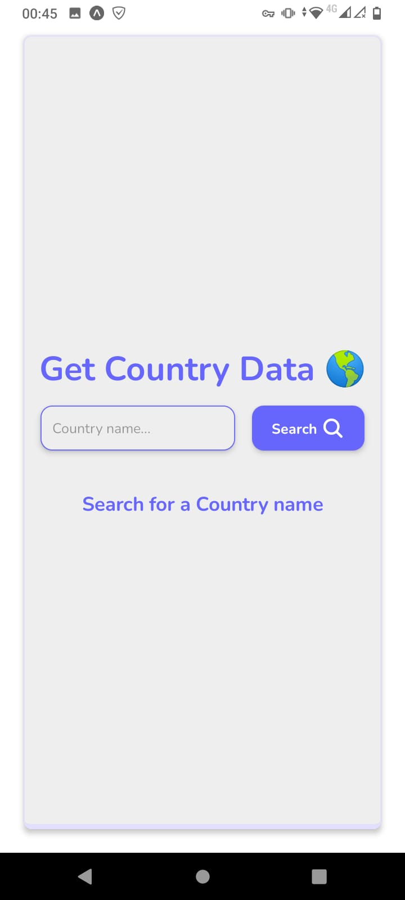
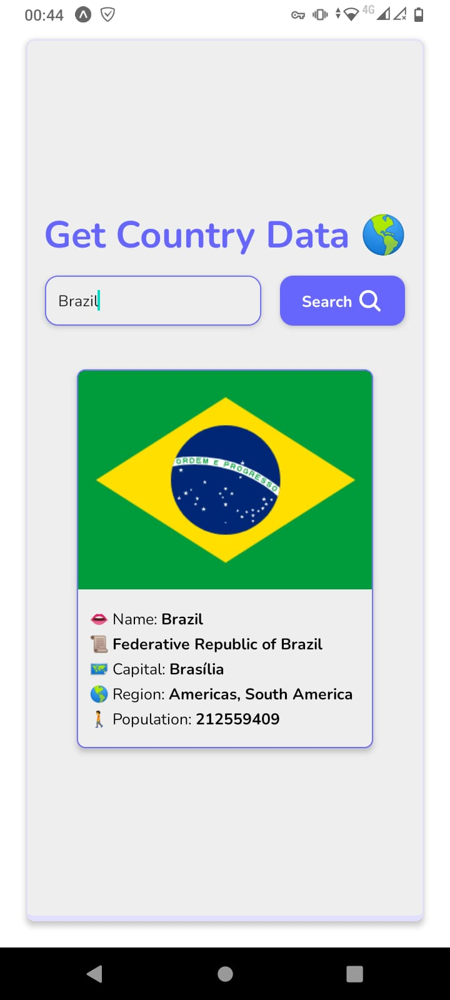
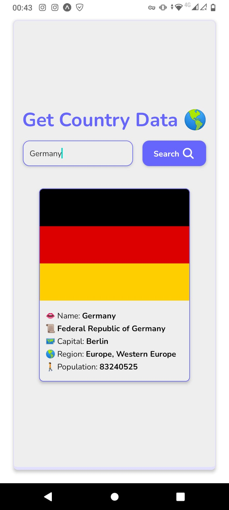
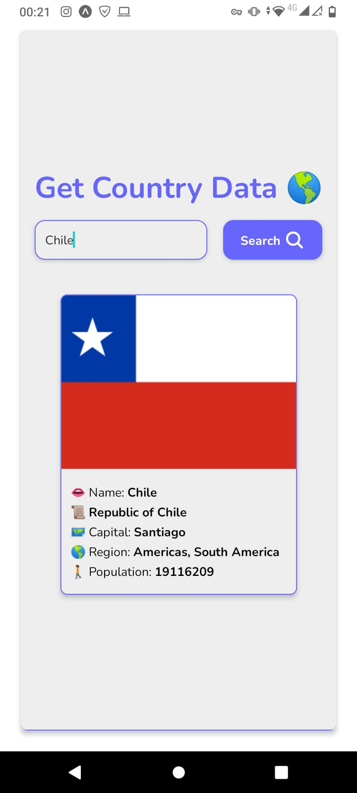

# CountryData 🌎

 ### This is a simple app that fetch country data from a WebApi.

 ### I was curious about how the fetch() function works in React Native and if I can built something with real data coming from the internet.

 ### And that was the result 👌
 
 #
 
 #
 

 

